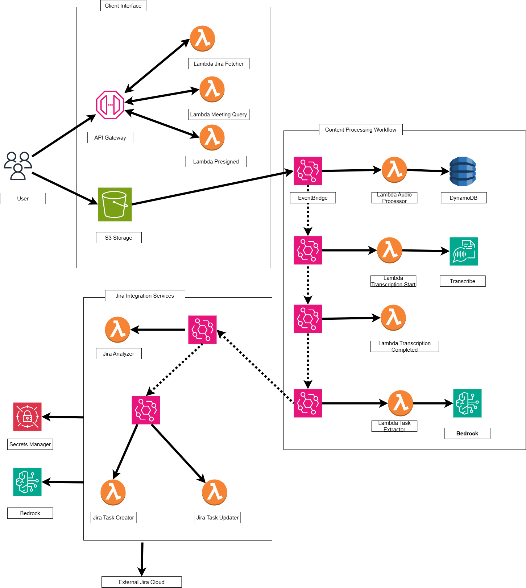

# Smart Meeting Assistant - AWS Lambda Hackathon Submission


## Project Overview

**Brief Description**: This application focuses on automating meetings by being able to upload 
an audio file and using AWS Lambda services to have the corresponding tasks extracted
and posted to Jira. 

**Problem Statement**: This project aims to solve an issue that most businesses face: those boring but necessary 
meetings that end up with people being assigned tasks. Having to actively pay attention and note what needs to be assigned as a 
task is frustrating and can result in mismatching a task to the assignee or other human error that we are prone to. 

**Solution Summary**: The way I propose to solve this problem is using my Smart Meeting Assistant. 
The user faces a React app, where he or she can upload an mp3 of a meeting, 
that will ultimately be transcribed, analyzed and transformed into Jira tasks.

## Architecture & AWS Lambda Usage

### Core Lambda Functions

#### 1. `presignedUrlHandler` - File Upload Handler
- **Purpose**: Provides secure, temporary URLs for direct file uploads to S3 without exposing AWS credentials
- **Trigger**: API Gateway HTTP requests
- **AWS Services Used**: S3, API Gateway
- **API Endpoint**:  POST `/presigned-url`, body: `{meetingId, fileName, contentType}` 


#### 2. `audioUploadProcessor` - S3 Event Processor
- **Purpose**: The user uploads an audio from the user-facing application and this function handles the storage
of the file metadata to DynamoDB and triggers the transcription workflow
- **Trigger**: S3 Object Created events via EventBridge
- **AWS Services Used**: S3, EventBridge, DynamoDB

#### 3. `meetingQueryHandler` - API Query Handler
- **Purpose**: Provides real-time status updates and meeting information to the frontend application
- **Trigger**: API Gateway HTTP requests
- **AWS Services Used**: DynamoDB, API Gateway
- **API Endpoint**: GET `/meeting/{meetingId}`, body: `None`

#### 4. `transcriptionStarter` - Transcription Job Initiator
- **Purpose**: Orchestrates the speech-to-text conversion process for uploaded meeting recordings,
by integrating Amazon Transcribe, which is being served the processed audio input. The command that links it to Amazon Transcribe is `StartTranscriptionJobCommand`
- **Trigger**: Custom EventBridge events ("Meeting Ready for Transcription")
- **AWS Services Used**: Amazon Transcribe, DynamoDB, EventBridge

#### 5. `transcriptionCompleteProcessor` - Transcription Result Handler
- **Purpose**: Processes completed transcription results and triggers the AI-powered task execution workflow.
- **Trigger**: Amazon Transcribe job state change events
- **AWS Services Used**: Amazon Transcribe, DynamoDB, EventBridge

#### 6. `taskExtractorHandler` - AI Task Extraction
- **Purpose**: Uses advanced AI to analyze meetings transcripts and extract actionable tasks with assignee, priorities and due dates.
- **Trigger**: Custom EventBridge events ("Transcription Complete")
- **AWS Services Used**: Amazon Bedrock (Claude), DynamoDB, EventBridge

#### 7. `jiraTaskAnalyzerHandler` - AI-Powered Task Analysis
- **Purpose**: Analyzes extracted meeting tasks using AI to determine which should be created as new Jira tickets versus which should update existing tickets.
Prevents duplicate work and maintains workflow continuity.
- **Trigger**: Custom EventBridge events ("Task Extraction Completed")
- **AWS Services Used**: Amazon Bedrock (Claude), DynamoDB, EventBridge, SecretsManager

#### 8. `jiraTaskCreationHandler` - New Task Creation
- **Purpose**: Creates new Jira tickets from meeting-extracted tasks that don't match existing work items. Handles user assignment, priority setting, and proper task formatting.
- **Trigger**: Custom EventBridge events ("Tasks Ready for Creation")
- **AWS Services Used**: External Jira API, DynamoDB, SecretsManager

#### 9. `jiraTaskUpdateHandler` - Existing Task Updates
- **Purpose**: Updates existing Jira tickets based on meeting discussions, including status changes, reassignments, and progress updates. Maintains project continuity by avoiding task duplication.
- **Trigger**: Custom EventBridge events ("Tasks Ready for Update")
- **AWS Services Used**: External Jira API, DynamoDB, SecretsManager

#### 10. `jiraTasksFetchHandler` - API GET Handler
- **Purpose**: Fetches all tasks from Jira project using REST API.
- **Trigger**: API Gateway
- **AWS Services Used**: External Jira API, SecretsManager
- **API Endpoint**: GET `/jira/tasks`, body: `None`


### Lambda Triggers Used

**API Gateway**:
- REST endpoints for file upload URLs and meeting queries
- CORS-enabled for web application integration
- Handles user-initiated requests for presigned URLs and meeting data

**EventBridge**:
- Custom event patterns for workflow orchestration
- Inter-service communication without tight coupling
- Event-driven architecture enabling scalable, loosely coupled microservices

**S3 Events**:
- Object creation events trigger automatic processing
- Serverless file processing pipeline

**Amazon Transcribe Events**:
- Job state change notifications for workflow progression
- Automated transcription result handling
- Integration with AWS native services for seamless integration

### AWS Services Integration

**AWS Lambda**: Core serverless compute service powering the entire application with automatic scaling, pay-per-execution 
pricing, and event-driven architecture. Each function has a single responsibility and communicates via events.

**Amazon S3**: Secure file storage for audio/video uploads with event triggers. Handles large media files efficiently 
with presigned URLs for direct uploads.

**Amazon DynamoDB**: NoSQL database for storing meeting metadata, transcription results, extracted tasks, and Jira integration status.
Provides fast, scalable data persistence.

**Amazon Transcribe**: AI-powered speech-to-text service that converts uploaded audio/video files into accurate transcriptions
for further processing.

**Amazon Bedrock**: Advanced AI service using Claude 3.5 Sonnet for intelligent task extraction, meeting summarization, and natural language understanding.

**Amazon EventBridge**: Event bus enabling loose coupling between services. Orchestrates the entire workflow from file upload to Jira ticket creation.

**API Gateway**: RESTful API endpoints for frontend integration with built-in CORS support, request validation, and Lambda integration.

## Features & Functionality

### Core Features

1. **Secure file upload**: Direct S3 uploads using presigned URLs for audio/video files up to several GB in size
2. **Automatic transcription**: AI-powered speech-to-text conversion with support for multiple audio formats
3. **Intelligent Task Extraction**: Advanced AI analysis that processes natural language and extracts actionable tasks with assignees, priorities, task summary and due dates
4. **Jira integration**: Automatic creation of properly formatted Jira tasks based on extracted tasks with further AI-processing for exact assignee Jira account match.
5. **Real-time Status Tracking**: Live update on processing status form upload to Jira ticket creation.

### User Workflow

1. **Upload Meeting Record**: User uploads audio file through React frontend
2. **Automatic Processing**: System transcribes audio, extracts tasks, and creates Jira tickets automatically
3. **Review Results**: User can switch to Jira tasks view from the main page and the created tasks will be fetched and
shown on the in-page board to see the end results.

## Technical Implementation

### Serverless Architecture Benefits

**Automatic Scaling**: Lambda functions scale automatically from zero to thousands of concurrent executions
based on demand. No infrastructure management required.

**Cost Efficiency**: Pay-per-execution model means cost scale directly with usage. No idle server costs during low activity periods.

**Event-Driven Design**: Loose coupling between components through EventBridge enables independent scaling and deployment of each service.

**Microservices Pattern**: Each Lambda function has a single responsibility, making the system maintainable, testable and scalable.

### Best Practices Implemented

**Error Handling**: Comprehensive try-catch blocks,  and graceful error responses with appropriate HTTP status codes.

**Logging & Monitoring**: CloudWatch integration for monitoring function performance, duration, and error rates. Structured logging for debugging.

**Security**: IAM roles with least privilege access, API authentication, secure presigned URLs with expiration, and encrypted data storage. 

**Code Organization**: Modular architecture with separate utility functions, service layers, and clear separations of concerns.

## Setup & Deployment

### Prerequisites
- AWS Account with appropriate permissions for Lambda, S3, DynamoDB, Transcribe, Bedrock
- Node.js 20+ for Lambda runtime
- AWS CLI configured with deployment credentials
- Jira instance with API access and admin permissions
- React development environment (Node.js, npm/yarn)
- AWS SAM CLI or CDK for infrastructure deployment

### Environment Variables & Configuration

```bash
  # AWS Configuration
AWS_REGION=eu-central-1
DYNAMODB_TABLE_NAME=meeting-records
AUDIO_BUCKET=smart-meeting-uploads
EVENTBRIDGE_BUS_NAME=meeting-events

# Jira Integration (stored in AWS Secrets Manager)
JIRA_SECRET_NAME=jira-meeting-tasks-config

# AI Configuration
BEDROCK_MODEL_ID=anthropic.claude-3-5-sonnet-20240620-v1:0

# API Configuration
CORS_ORIGIN=http://localhost:5173

# Frontend Environment Variables (.env)
# IMPORTANT: replace this with the newly deployed API Gateway endpoint
VITE_API_BASE_URL=https://mt8d9y8i79.execute-api.eu-central-1.amazonaws.com/Prod
```

## Deployment Steps

1. **Clone and Setup Repository**:

```bash
# Clone repository
git clone https://github.com/Eduardismund/aws-hackathon-project
cd aws-hackathon-project

# Install dependencies
npm install

# Configure AWS credentials
aws configure
# Enter your AWS Access Key ID, Secret Access Key, and set region to eu-central-1
```
2. **Configure Jira Integration**:

**Note**: The following setup is part of a test environment, having restricted time limit.
If you're following these instructions, please be aware that you may need to use your own Jira credentials rather than 
the demo credentials shown here.

The secret contains: 
- **JIRA_BASE_URL**: Your Jira instance URL
- **JIRA_EMAIL**: Email associated with your Jira account
- **JIRA_API_TOKEN**: API token for authentication
- **JIRA_PROJECT_KEY**: Project key where tasks will be created
- **JIRA_BOARD_ID**: Board ID for task organization

```bash
# Create Jira API credentials secret in AWS Secrets Manager
aws secretsmanager create-secret \
  --name "jira-meeting-tasks-config" \
  --description "Jira credentials for meeting tasks integration" \
  --secret-string '{"JIRA_BASE_URL": "https://meetingtasksdemo.atlassian.net", "JIRA_EMAIL": "meetingtasks.demo@proton.me", "JIRA_API_TOKEN": "ATATT3xFfGF0ovjrs6CX445yaatTd-r-EJo5iFsIUHMS_7CU2ieB6EkF8g4yHGdfdlqL-wgBl0ExKY8A5rUmPoSqn46ya8E4C4T42CTifQ6ga3HCNxt07e0brp4z6oB5c5PAdt6-AZUUDJzhg6McC5AN9myIc0yxc-h3N6dPZzC-dFlA7mARLxc=FE4A5569", "JIRA_PROJECT_KEY": "CRM", "JIRA_BOARD_ID": "1"}' \
  --region eu-central-1

# (Optional) Verify secret creation
aws secretsmanager get-secret-value \
  --secret-id "jira-meeting-tasks-config" \
  --region eu-central-1
```

3. **Infrastructure Deployment**

```bash
# Build Lambda functions
sam build

# Deploy infrastructure 
sam deploy \
  --stack-name asa-si-eu-no-tu-ioi \
  --capabilities CAPABILITY_IAM CAPABILITY_NAMED_IAM \
  --region eu-central-1 \
  --resolve-s3 \
  --force-upload \
  --no-confirm-changeset

```

4. **Frontend Development & Deployment**

```bash
# Navigate to frontend directory
cd frontend

# Install React dependencies
npm install

# Start development server with Vite
npm run dev

# Output:
# VITE v6.3.5  ready in 441 ms
# ➜  Local:   http://localhost:5173/
# ➜  Network: use --host to expose
# ➜  press h + enter to show help

# Access the application at http://localhost:5173/
```

